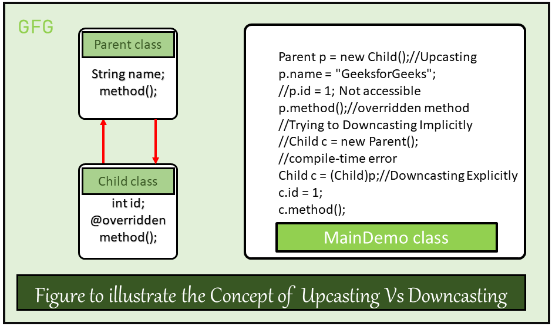

# **Typecasting in Java (Objects)**

Typecasting is one of the most important concepts in Java that deals with **converting one data type to another** — either **implicitly** or **explicitly**.

Just like primitive data types, **objects can also be typecasted**.  
However, in the case of objects, there are only **two types of objects**:
- **Parent object**
- **Child object**

Therefore, **typecasting of objects** basically means converting one type of object (**child** or **parent**) into another.

---

## **Types of Object Typecasting**

### **1️⃣ Upcasting**
- **Definition: Upcasting is the typecasting of a child object to a parent object.
-  Upcasting gives us the flexibility to access the parent class members but it is not possible to access all the child class members using this feature. Instead of all the members, we can access some specified members of the child class. For instance, we can access the overridden methods.
- **Nature:** Can be done **implicitly** (no cast required).
- **Access:**  
  - Allows access to **parent class members**.
  - Cannot access all **child class members** — only **overridden methods** and members defined in the parent class.
- **Purpose:** Provides flexibility in handling objects in a generic way.

**Example:**
```java
class Parent {
    void display() { System.out.println("Parent class method"); }
}

class Child extends Parent {
    @Override
    void display() { System.out.println("Child class overridden method"); }
    void childMethod() { System.out.println("Child-specific method"); }
}

public class Main {
    public static void main(String[] args) {
        Child child = new Child();

        // ✅ Implicit upcasting
        Parent parentRef = child;

        parentRef.display();  // Calls overridden method in Child
        // parentRef.childMethod(); ❌ Not allowed (parent reference)
    }
}
```




# **Downcasting in Java**

## **Definition**
Downcasting means the typecasting of a parent object to a child object. Downcasting cannot be implicit.

Unlike upcasting, **downcasting has to be done explicitly** (externally) by the programmer.  
This is because not all parent objects are actually child objects, so Java enforces explicit casting to avoid accidental misuse.


Since not all parent objects are actually child objects, **downcasting is not always safe**.  
If done incorrectly, it results in a **`ClassCastException`** at runtime.


---

## **Key Points**
- **Explicit Casting Required** – Downcasting cannot be done implicitly.
- **Safe Only When** the actual object is an instance of the child class.
- **Use `instanceof`** to check before performing downcasting.
- Allows access to **child-specific members** that are not in the parent class.

---


## **Key Insight**
When we downcast, the **child object can still acquire the properties of the parent class** (since it inherits from it),  
but we also gain access to **child-specific members** that are not accessible through the parent reference.

---

## **Example**
```java
class Parent {
    void parentMethod() {
        System.out.println("Parent method");
    }
}

class Child extends Parent {
    void childMethod() {
        System.out.println("Child method");
    }
}

public class Main {
    public static void main(String[] args) {
        Parent p = new Child();        // Upcasting
        Child c = (Child) p;           // Explicit downcasting

        c.parentMethod();              // Access parent method
        c.childMethod();               // Access child-specific method
    }
}

```


## ✅ Safe Downcasting in Java

Downcasting in Java means converting a **parent class reference** into a **child class reference**.  
It must be done **safely**, or it can cause a `ClassCastException` at runtime.

---

## 🔹 Safe Downcasting Rule
You can only downcast if the **actual object** is an instance of the **child class**.

```java
Parent5 m = new Child5();  // Upcasting first — valid
Child5 c = (Child5) m;     // ✅ Downcasting — safe, because m actually holds Child5
```

### 🔹 How to Check Before Downcasting in Java

When performing **downcasting** in Java, it is important to ensure that the object is actually an instance of the **child class** before casting.  
Failing to do so can lead to a `ClassCastException` at runtime.

---

### ✅ Safe Way: Using `instanceof`

```java
if (m instanceof Child5) {
    Child5 c = (Child5) m;
    System.out.println("Downcasting successful!");
} else {
    System.out.println("Downcasting not possible.");
}
```

