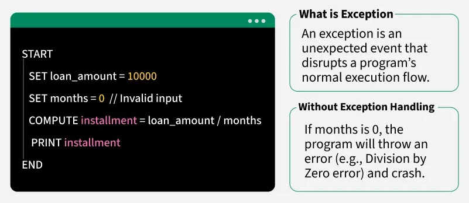

## Java Exception Handling

Exception handling in Java is an effective mechanism for managing runtime errors to ensure the application's regular flow is maintained. Some Common examples of exceptions include ClassNotFoundException, IOException, SQLException, RemoteException, etc. By handling these exceptions, Java enables developers to create robust and fault-tolerant applications.

Note: When an exception occurs and is not handled, the program terminates abruptly and the code after it, will never execute.

Example: The below Java program modifies the previous example to handle an ArithmeticException using try-catch and finally blocks and keeps the program running.


```java
import java.io.*;
​
class Geeks {
    public static void main(String[] args)
    {
        int n = 10;
        int m = 0;
​
        try {
          
            // Code that may throw an exception
            int ans = n / m;
            System.out.println("Answer: " + ans);
        }
        catch (ArithmeticException e) {
          
            // Handling the exception
            System.out.println(
                "Error: Division by zero is not allowed!");
        }
        finally {
            System.out.println(
                "Program continues after handling the exception.");
        }
    }
}
```


Output
Error: Division by zero is not allowed!

Program continues after handling the exception


### Java Exception Hierarchy
In Java, all exceptions and errors are subclasses of the Throwable class. It has two main branches

- Exception.
- Error


Major Reasons Why an Exception Occurs
Exceptions can occur due to several reasons, such as:


# Java Errors vs Exceptions

In Java, problems during execution are broadly classified into **Errors** and **Exceptions**.  
Understanding the difference is crucial for writing robust and fault-tolerant programs.

---

## 🔹 Errors
- Represent **serious problems** that are usually **beyond the programmer’s control**.
- Indicate issues with the **system, hardware, or JVM environment**.
- These problems **cannot be handled** using code (not recoverable in most cases).
- Examples:
  - `OutOfMemoryError` → JVM runs out of heap memory
  - `StackOverflowError` → caused by deep or infinite recursion
  - `VirtualMachineError` → JVM crashes
  - Hardware failure

👉 Errors should **not be caught or handled** in normal applications.

---

## 🔹 Exceptions
- Represent **runtime issues** caused by invalid program logic or external conditions.
- Unlike errors, **exceptions can and should be handled** to prevent program crashes.
- Allow the program to **recover gracefully**.
- Two types:
  1. **Checked Exceptions**  
     - Verified at **compile-time**.  
     - Must be either handled with `try-catch` or declared using `throws`.  
     - Example: `IOException`, `SQLException`, `FileNotFoundException`.
  2. **Unchecked Exceptions (Runtime Exceptions)**  
     - Verified at **runtime**.  
     - Caused by programming mistakes.  
     - Example:  
       - `NullPointerException`  
       - `ArrayIndexOutOfBoundsException`  
       - `ArithmeticException` (like divide by zero)  
       - `ClassCastException`

---

## ⚡ Common Problem Scenarios Why wxception occurs
- Invalid user input
- Device failure
- Loss of network connection
- Out-of-disk memory
- Opening an unavailable file
- Database errors
- Arithmetic errors
- Type mismatch
- Null reference
- Code errors (logic bugs)
- Out of bound

---

## 📝 Summary
- **Errors** → Serious problems, outside programmer’s control, not recoverable.  
- **Exceptions** → Runtime issues, can be handled to keep the program running.  

> Rule of Thumb: Handle **Exceptions**, don’t handle **Errors**.


### Types of Java Exceptions


Exceptions can be categorized in two ways:

1. Built-in Exceptions

Checked Exception

Unchecked Exception

2. user-defined Exceptions

<hr/>

1. Built-in Exception
Build-in Exception are pre-defined exception classes provided by Java to handle common errors during program execution. There are tw type of built-in exception in java.

Checked Exceptions

- Checked exceptions are called compile-time exceptions because these exceptions are checked at compile-time by the compiler. Examples of Checked Exception are listed below:

- ClassNotFoundException: Throws when the program tries to load a class at runtime but the class is not found because it's belong not present in the correct location or it is missing from the project.

- InterruptedException: Thrown when a thread is paused and another thread interrupts it.
- IOException: Throws when input/output operation fails.
- InstantiationException: Thrown when the program tries to create an object of a class but fails because the class is abstract, an interface or has no default constructor.
- SQLException: Throws when there is an error with the database.
- FileNotFoundException: Thrown when the program tries to open a file that does not exist.


Unchecked Exceptions


The unchecked exceptions are just opposite to the checked exceptions. The compiler will not check these exceptions at compile time. In simple words, if a program throws an unchecked exception and even if we did not handle or declare it, the program would not give a compilation error. 

- Examples of Unchecked Exception are listed below:

- ArithmeticException: It is thrown when there is an illegal math operation.
- ClassCastException: It is thrown when we try to cast an object to a class it does not belong to.
- NullPointerException: It is thrown when we try to use a null object (e.g. accessing its methods or fields).
- ArrayIndexOutOfBoundsException: This occurs when we try to access an array element with an invalid index.
- ArrayStoreException: This happens when we store an object of the wrong type in an array.
- IllegalThreadStateException: It is thrown when a thread operation is not allowed in its current state.


2. User-Defined Exception
Sometimes, the built-in exceptions in Java are not able to describe a certain situation. In such cases, users can also create exceptions, which are called "user-defined Exceptions".

Methods to Print the Exception Information

- printStackTrace(): Prints the full stack trace of the exception, including the name, message and location of the error.
- toString(): Prints exception information in the format of the Name of the exception.
- getMessage() : Prints the description of the exception